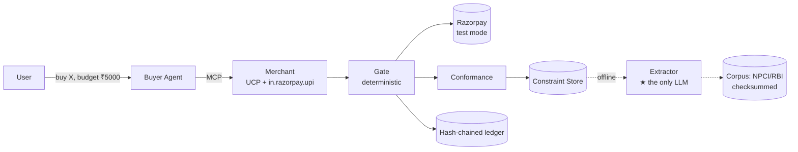
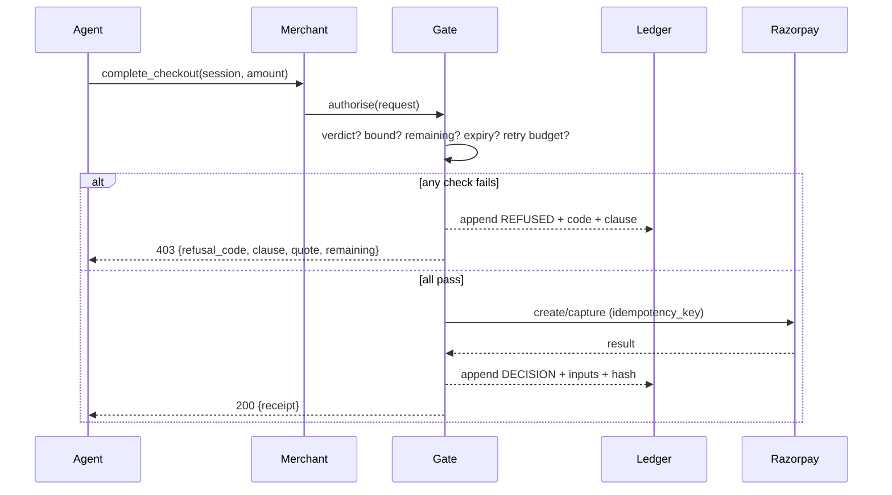

# ARCHITECTURE v1 — draft for AgentA review

**System:** an agent-payable Indian merchant that verifies a counterparty's payment claims against the circulars that authorise them, and can prove why it refused.

---

## 1. The one invariant

> **No rupee bound may be enforced unless it is traceable to a clause in a checksummed source document. The model may read documents. The model may never move money.**

Everything below follows from that sentence.

## 2. Context



## 3. Components

| # | Component | Deterministic? | Responsibility |
|---|---|---|---|
| 1 | **Corpus** | ✅ | Immutable source documents + SHA-256 + provenance. Never mutated; new versions are new rows. |
| 2 | **Extractor** | ❌ **LLM** | Scanned page → `ConstraintClaim[]`. **The only LLM in the constraint path.** |
| 3 | **Constraint Store** | ✅ | Authoritative claims, keyed by `(doc_sha256, clause_ref)`. Append-only. |
| 4 | **Conformance** | ✅ | `declared × authoritative → Verdict{PASS｜FAIL｜UNDETERMINED, citation, reason}` |
| 5 | **Gate** | ✅ | Money-path enforcement. Pure function of `(request, block_state, verdict, clock)`. |
| 6 | **Ledger** | ✅ | Hash-chained, append-only, verifiable **in both directions**. |
| 7 | **Merchant** | ✅ | UCP handler `in.razorpay.upi`, `/.well-known/ucp`, MCP checkout tools. |
| 8 | **Buyer Agent** | ❌ LLM | Goal decomposition, product selection. **Off the money path.** |
| 9 | **Eval** | ✅ | Batch harness, baselines, ablations, self-conformance. |

## 4. The three flows

### 4.1 Ingestion — offline, LLM present

`fetch → checksum → render pages → extract → validate → store`

Extraction emits, per claim: `value_minor_units · unit · scope · subject · clause_ref · page · verbatim_quote · confidence`.

**Low confidence does not become a guess — it becomes `UNDETERMINED`.** A claim that cannot be resolved is stored as unresolved and *counted*, never silently dropped.

### 4.2 Conformance — runtime, per counterparty, LLM present (reading only)

Agent meets merchant → fetch `/.well-known/ucp` + declared terms → extract declared constraints → compare against Constraint Store → `Verdict`.

**Verdicts are cached by `(counterparty_doc_sha256, constraint_store_version)`** — so the same inputs always yield the same verdict, and a verdict can be re-derived months later. Reproducibility is a design requirement, not a nicety.

### 4.3 Money path — runtime, **no LLM anywhere**



**Gate checks, in order** (all integer paise, all deterministic):
1. Counterparty conformance verdict is `PASS`
2. `amount ≤ block_max` and `amount ≤ remaining`
3. block not expired (≤ 90 days, OC-228)
4. block ≤ ₹10,000 (OC-228)
5. retry budget: ≤ 3 per 24h, **timeouts only** (OC-228 §3)
6. merchant binding (one block per customer-merchant pair, OC-228 §4)
7. idempotency key unused

Each check names the clause it enforces. **A check with no clause cannot be added** — CI rejects it.

## 5. Data model (core)

```
Document(sha256 PK, source_url, retrieved_at, circular_no, issued_on, page_count)
ConstraintClaim(id PK, doc_sha256 FK, clause_ref, value_minor, unit, scope,
                subject, quote, confidence, status[RESOLVED|UNDETERMINED])
Counterparty(id PK, name, ucp_url, terms_sha256)
Verdict(id PK, counterparty_id FK, doc_sha256, store_version,
        result[PASS|FAIL|UNDETERMINED], failing_claim_id, reason, created_at)
Block(id PK, customer_id, merchant_id, max_minor, remaining_minor, expires_at, state)
LedgerEntry(seq PK, prev_hash, payload_json, hash)   -- hash = H(prev_hash || payload)
```

## 6. Failure handling

| Failure | Behaviour |
|---|---|
| Source unreachable (NPCI 403) | Serve from checksummed local corpus. **Never fetch live in the money path.** |
| Extraction low-confidence | `UNDETERMINED` → **refuse**, counted, surfaced. Never a guess. |
| Counterparty terms changed (hash mismatch) | Invalidate cached verdict → re-check → refuse until resolved |
| Razorpay API timeout | Retry ≤3/24h **only for timeouts** (OC-228 §3); any other decline → no retry |
| Duplicate request | Idempotency key → replay original response, **no side effects** |
| Ledger tamper | Chain verification fails in both directions → system refuses to authorise |
| Clock skew | Expiry evaluated server-side only |

## 7. Where we deliberately do NOT use an LLM

| Component | LLM? | Why |
|---|---|---|
| Extraction | **Yes** | Joint value+unit+scope+meaning resolution over scanned prose; the naive regex reproduces a shipped 3× bug and cannot catch semantic contradictions at all |
| Conformance comparison | **No** | Integer + enum comparison. A model here adds nondeterminism to a decidable question. |
| Gate | **No** | Money path. Must be replayable and auditable. |
| Limit arithmetic | **No** | Integer paise. |
| Retry accounting | **No** | Counting. |
| Idempotency / hashing | **No** | Cryptographic, deterministic by definition. |
| Buyer agent | **Yes** | Goal decomposition, product choice — off the money path. |

## 8. Security / threat model (abbreviated)

- **Prompt injection from merchant documents** → extraction output is schema-constrained and never becomes executable policy without passing conformance; the gate reads the *store*, never raw merchant text.
- **Tampered corpus** → checksums verified at load; mismatch halts.
- **Replay** → idempotency keys, ledger chain.
- **Secrets** → test-mode keys only, `.env`, never committed; probe refuses live keys.

## 9. Deployment

Single container + SQLite (or Postgres) + a static `/.well-known/ucp`. `docker compose up` seeds the corpus and runs the eval. Target: **`git clone && make demo` works on a clean machine** — "does it run" is a graded pillar.

## 10. Known weaknesses (stated, not hidden)

1. **Razorpay TSP has no public API** — the delegation layer is stubbed and declared.
2. **Extraction quality is the system's ceiling.** Mitigated by measurement, not by claims.
3. Conformance covers **payment constraints only**, not general contract terms.
4. `UNDETERMINED` rate may be high on poor scans — reported, not hidden.
